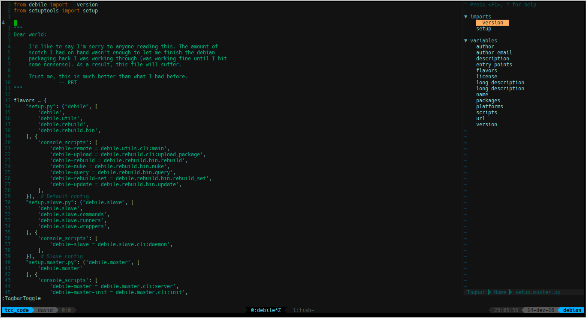

# dotfiles
This repository keeps my precious dotifiles.

I made some scripts, to install all dependencies, and put the files
in the correct directories. This scripts also make a "backup", of the 
existents dotfiles.

## Install

To install my vimrc, just run on the terminal
        
        ./dotf.sh install vim

This will do the following steps:

- Backup the existents dotfiles in ~/.dotf_bkps/
- Install vim dependencies
- Install vim plugins

You can install more then one dotfile

        ./dotf.sh install vim bash

You can restore your older dotfiles

        ./dotf.sh restore vim

To see the options

        ./dotf.sh help

In this moment, the following dotfiles are supported:

- vimrc
- bashrc
- muttrc
- tmux.conf
- tmuxinator

## ScreenShots

