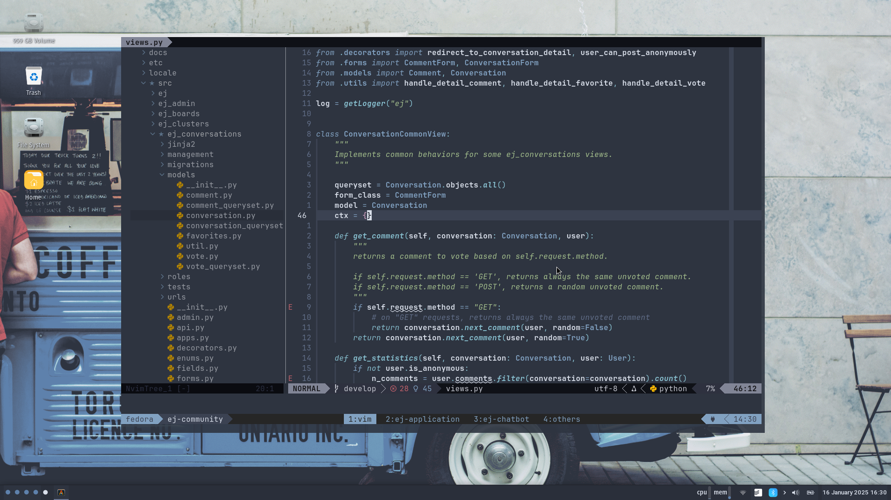

# Meus arquivos de configuração :pencil: :blue_heart:

<figure>
  
  <figcaption>Meu ambiente de trabalho</figcaption>
</figure>

<figure>
  
  <figcaption>Neovim com o tema Nord</figcaption>
</figure>

Esse repositório versiona arquivos de configuração das diferentes ferramentas que utilizo no dia a dia de trabalho.
A configuração do ambiente de trabalho foi automatizada com a ferramenta [Ansible](https://docs.ansible.com/ansible).
O ambiente segue as seguintes premissas:

- Neovim como editor de texto.
- Nord como tema padrão para o XFCE4 e seus aplicativos.
- Rofi como lançador de aplicativos (win+enter).

## Permissão de root

O comando do Ansible que configura o ambiente precisa de permissão de root no sistema operacional para
instalar pacotes e criar diretórios. Garanta que no arquivo `/etc/sudoers` existe a sefguinte linha para o
usuário que irá executar o script:

    seuusername     ALL=(ALL)       ALL

## Configurando o ambiente

Para instalar a ferramenta Ansible, entre no diretório `ansible` e execute o script `install.sh`.
O script criará um virtualenv do Python no diretório `.venv`, além de instalar o pacote `ansible-core`.
Ao final, você poderá executar os playbooks do Ansible com o comando:

        source .venv/bin/activate # caso o virtualenv não esteja ativo
        ansible-playbook -i inventory.yml base.yml nvim.yml

Os seguintes playbooks estão disponíveis para configuração doa ambiente:

- **base.yml**: Instala uma série de pacotes utilizados amplamente pelo sistema.
- **terminal.yml**: Instala e configura o terminal Alacritty.
- **tmux.yml**: Instala e configura a ferramenta Tmux.
- **nvim.yml**: Instala e configura o editor Neovim.
- **docker.yml**: Instala e configura a engine do Docker.
- **python.yml**: Instala alguns pacotes do Python, como o Poetry e Pipx.
- **xfce4.yml**: Realiza customizações em um ambiente XFCE4.
- **rofi.yml**: Instala e configura o lançador de aplicativos Rofi.

Para configurar um ambiente completo, execute o seguinte comando dentro do diretório:

        source .venv/bin/activate # caso o virtualenv não esteja ativo
        ansible-playbook -i inventory.yml base.yml terminal.yml tmux.yml nvim.yml docker.yml python.yml xfce4.yml rofi.yml

## Vagrant

Caso você queria testar os playbooks do Ansible em um ambiente isolado, é possível criar
uma máquina virtual utilizando o arquivo `Vagrantfile`, disponível no repositório. Siga
as instruções do [Vagrant](https://www.vagrantup.com/) e [Vagrant Libvirt](https://github.com/vagrant-libvirt/vagrant-libvirt)
para criar uma máquina virtual no Fedora.
